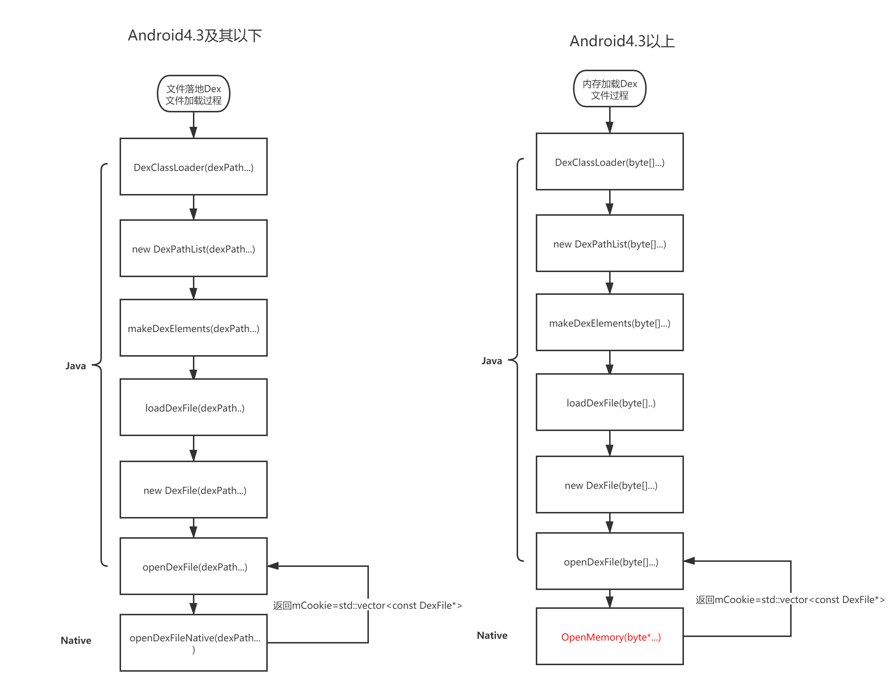

# Overview

(学习实践) `Xpsosed插件 + Inline Hook`实现脱内存加载类型的二代壳。

# 使用说明

针对Android版本：4.1

```
1. 安装Xposed脱壳插件：XposedHookCMethod.apk
2. 任意打开或者安装一个APK
3. 获取脱壳后的原始DEX文件：/sdcard/dump.dex
```

# 原理

通过Xposed插件注入Inline Hook模块，hook `openMemory`函数，获取其参数中的原始DEX内存地址并将其DUMP下来。
下面是操作中的步骤，贴出了核心代码，具体实现看source code。

### 第一步
Xposed插件实现每个APP注入Inline Hook的so模块。
```
public class XposedMain implements IXposedHookLoadPackage {
    @Override
    public void handleLoadPackage(XC_LoadPackage.LoadPackageParam loadPackageParam) throws Throwable {
        /**
         * native hook 的第一步：向目标进程植入so文件
         *
         * 1：在指定包名的进程中注入InlineHook的so库
         */

        XposedBridge.log("[*] HOOK Package=" + loadPackageParam.packageName);
        XposedHelpers.callStaticMethod(Runtime.class, "nativeLoad", "/data/local/tmp/test.so", loadPackageParam.classLoader, "/system/lib");
    }
}
```

### 第二步
Inline Hook模块hook `openMemory`函数来Dump内存中的原始DEX文件。
```
HookerX86* hookerX86 = new HookerX86;
void *artlib =  fake_dlopen("/system/lib/libart.so", RTLD_LAZY);

JNIEXPORT jint JNI_OnLoad(JavaVM *vm, void *reserved){
    JNIEnv *env = NULL;

    /**
     * 1.获取对应对应Android 22版本 libart.so模块OpenMemory函数的地址。
     */
    if(vm->GetEnv((void**)&env, JNI_VERSION_1_4) != JNI_OK)
        return -1;
    log_err("vm->GetEnv complete");

    if(!artlib){
        exit(0);
    }
    log_err("fake_dlopen complete");
    org_artDexFileOpenMemory22 openMemory22 = (org_artDexFileOpenMemory22)fake_dlsym(artlib,
            "_ZN3art7DexFile10OpenMemoryEPKhjRKNSt3__112basic_stringIcNS3_11char_traitsIcEENS3_9allocatorIcEEEEjPNS_6MemMapEPKNS_7OatFileEPS9_");

    if(!openMemory22){
        exit(0);
    }
    /**
     * 2.覆盖OpenMemory函数头部指令为跳转指令。
     */
    hookerX86->hook((void*)openMemory22, (void *)dumpdex, true);

    return JNI_VERSION_1_4;
}

void *dumpdex(const uint8_t *base, size_t size,
              const std::string &location, uint32_t location_checksum,
              void *mem_map, const void *oat_file, std::string *error_msg){
    /**
     * 3.DUMP内存中的原DEX文件。
     */
    log_err("开始dump原DEX");
    log_err("[*] DEX内存地址(%p)", base);
    void* dexContent = malloc(size);
    memcpy(dexContent, base, size);
    std::ofstream outfile;
    outfile.open("/sdcard/dump.dex");
    if(!outfile.is_open()){
        log_err("open file dump.dex failed");
    }

    outfile.write(static_cast<const char *>(dexContent), size);
    outfile.close();
    free(dexContent);
    /**
     * 4.还原被hook的OpenMemory函数头部指令，并执行调用OpenMemory函数继续执行流程。
     */
    org_artDexFileOpenMemory22 openMemory22 = (org_artDexFileOpenMemory22)fake_dlsym(artlib,
                                                                                     "_ZN3art7DexFile10OpenMemoryEPKhjRKNSt3__112basic_stringIcNS3_11char_traitsIcEENS3_9allocatorIcEEEEjPNS_6MemMapEPKNS_7OatFileEPS9_");
    hookerX86->unhook((void *)openMemory22);

     void * retaddr = openMemory22(base, size, location, location_checksum, mem_map, oat_file, error_msg);
     log_err("call origin openMemory completed");
     return retaddr;
}
```

# Issues

`【为什么native层Hook openMemory方法？】`

参考  Dex文件的加载流程，4.3以下hook native函数`openDexFileNative`，4.3以上hook`OpenMemory`


# 参考

【1】 [inline-hook](https://github.com/liuyx/inline-hook)

【2】 [[原创]Art 模式 实现Xposed Native注入](https://bbs.pediy.com/thread-251171.htm)

【3】 [Nougat_dlfunctions](https://github.com/avs333/Nougat_dlfunctions)